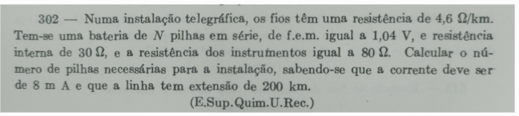
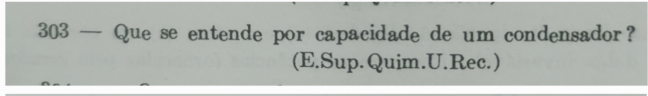
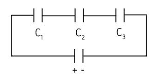
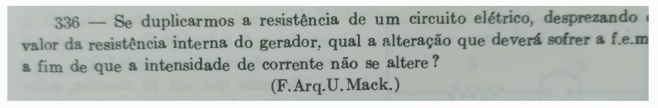
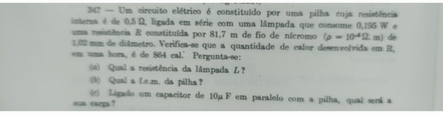
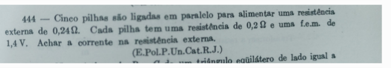
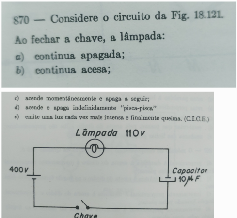
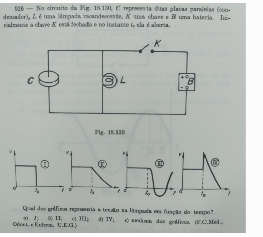

# Lista 

## Exercício 302

### Resolução

R = 4,6 ohm/km

N pilhas em série, 1,04V cada uma .

R interna = 30 Ω.

R instrumentos = 80 Ω.

i = 8 mA, $ = 8.10^{-3}A$.

200 km de fio

$$4,6 ohm/km * 200 km = 920 Ω$$

temos que 
$$Rtotal = Rinterna + Rinstrumentos  + Rfio$$

$$R total = 30 + 80 + 920$$
$$r total = 1030 Ω.$$

Pela lei de ohm

V = R . i

$$Vtotal = Rtotal . itotal$$

$$Vtotal = 1030 * 8.10^{-3}$$
$$Vtotal = 8,24 V$$

$$

numero-de-pilhas = \frac{Vtotal}{Vpilha}= \frac{8,24V}{1,04V} = 7,92 = 8pilhas

$$

## Exercício 303

### Resolução

Capacidade ou capacitância é propriedade de acumular cargas sob um determinada tensão. Ela pode ser descrita como

$$C = \frac{Q}{V}$$
$$Q  = C.v$$

Unidade Farad

## Exercício 336

### Resolução

$U = R.i$

Antes

$V1 = R1. i1$

Depois

$V2 = 2*R1*i2

$$

i1 = i2
$$

$$\frac{V1}{R1} = \frac{V2}{2R1}$$

$$ V2 = 2V1 $$

Resposta

Temos que dobrar a tensão

## Exercício 347

### Resolução

R interna da pilha = 0,5 Ω.

P = 0,195 W.

Resistência R

que é um fio, de nicromo

p = $10^{-4}$

diâmetro do fio = 1,02mm = $1,02x10^{-3} m$

comprimento do fio = 81,7 m

Q calor em 1 hr = 864 cal.

Conversões

1 cal = 4,18 J.

1 hr = 3600 s.

Resistência do fio

$$

R = p * \frac{L}{A}

$$

Como é um fio

se d = $1,02*10^{-3}m$ então r = $0,51*10^{-3}m$

área = pi * raio² = $8,17x10^{-7}m^2$

$$
    R = 10^{-6}* \frac{81,7}{8,17.10^{-7}} = 100 Ω.
$$

Q = 864 cal * 4,18 J/cal = 3611,52 J.

$P = i^{2} * R$

$P = E/t$

$$
\frac{E}{t}= i^2 * R

$$

$$
E= i^2 * R * t
$$

$$
    3611,52 = i^2 * 100 * 3600
$$
$$
    i^2 = 10*10^{-3}
$$
$$
    i = 0,1A
$$

a) R lampada.

$$
    P = R * i^{2}
$$
$$
    0,195 = R * 0,1^2
$$
$$0,196 * 10^2 = 19,5 Ω$$

b) $$ Vp = Rt * it $$
   $$ Vp = (0,5 + 19,5 + 100)*0,1  $$
$$120*0,1 = 12V $$

c)

$$ q = C * V $$
$$ q = 10 * 10^-6 * 12$$
$$ q = 1,2 * 10^{-4} C $$

## Exercício 444

### Resolução

Rext = 0,24 Ω.
R pilha = 0,2 Ω.
Vpilha = 1,4 V.

5 pilhas ligadas em paralelo.

Req = r/n

$$ Req-interna = 0,2/5 = 0,04Ω.$$

$$ Req = \frac{1}{\frac{1}{R1}+\frac{1}{R2}+\frac{1}{Rn}}
$$

$$
    Req = \frac{R1 * R2}{R1+R2}
$$

Veq = v1 = v2...  v5 = 1,4 V

R total = req + Rext
$$
R total = 0,04 + 0,24 = 0,28 Ω.
$$

$$ It = \frac{Veq}{Rt} = \frac{1,4V}{0,28Ω} = 5A.

$$

## Exercício 466

### Resolução

V com circuito fechado = 0,8 V
V com circuito aberto = 1 V

$$
    Vcf = Vca - (icf * Rin)
$$

$$
    icf = \frac{Vcf}{R}
$$

$$ 0,8 = 1 - \frac{0,8}{R}*r $$
$$ \frac{0,8}{R}*r = 0,2 $$
$$ r = \frac{0,2*R}{0,8} $$
$$ r = \frac{1*R}{4}$$
$$ r = \frac{R}{4} $$

## Exercício 474

### Resolução

Volt.

## Exercício 482

### Resolução

$$ C = \frac{E*A}{L} $$

E -> permissividade absoluta do material dielétrico entre as placas

A -> Area de uma das placas

L -> distância entre elas

## Exercício 870

### Resolução

## Exercício 926

### Resolução

Anexada a Parte, no entanto resposta letra b) .

